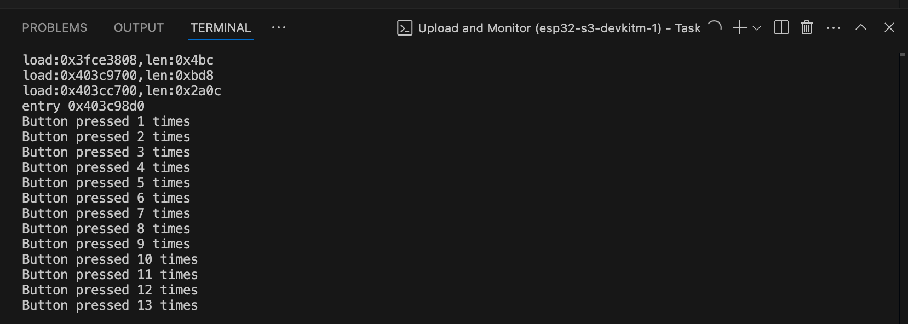

# Práctica 2: Interrupciones en ESP32

## Introducción

El objetivo de esta práctica es comprender y aplicar el uso de interrupciones en el microcontrolador ESP32, tanto por eventos hardware (botones) como mediante temporizadores (timers). Esto se consigue a través del control de un LED NeoPixel, modificando su comportamiento en función de las interrupciones generadas por el usuario o el sistema.

Se han realizado dos programas:

- Código 1: Usa una interrupción por hardware (botón) para contar pulsaciones.
- Código 2: Usa una interrupción por temporizador para leer dos botones y ajustar la frecuencia de parpadeo de un NeoPixel.

---

## Código 1: Interrupción por GPIO (botón)

### Objetivo

Contar cuántas veces se pulsa un botón utilizando una interrupción por hardware, y encender brevemente un LED NeoPixel como señal visual.

### Código

```cpp
#include <Arduino.h>
#include <Adafruit_NeoPixel.h>

#define LED_PIN 48
#define BUTTON_PIN 18
#define NUMPIXELS 1

volatile uint32_t buttonPressCount = 0;
volatile bool buttonPressed = false;

Adafruit_NeoPixel strip(NUMPIXELS, LED_PIN, NEO_GRB + NEO_KHZ800);

void IRAM_ATTR isr() {
  buttonPressCount++;
  buttonPressed = true;
}

void setup() {
  Serial.begin(115200);
  pinMode(BUTTON_PIN, INPUT_PULLUP);
  strip.begin();
  strip.show();
  attachInterrupt(digitalPinToInterrupt(BUTTON_PIN), isr, FALLING);
}

void loop() {
  if (buttonPressed) {
    Serial.printf("Button pressed %u times\n", buttonPressCount);
    buttonPressed = false;

    strip.setPixelColor(0, strip.Color(255, 255, 255));
    strip.show();
    delay(100);
    strip.setPixelColor(0, strip.Color(0, 0, 0));
    strip.show();
  }
}
```

### Funcionamiento

- Se configura una interrupción en el pin **18** al detectar un flanco de bajada (`FALLING`).
- Cada vez que se pulsa el botón, se incrementa el contador `buttonPressCount`.
- Se enciende brevemente el LED **NeoPixel** en color blanco para indicar la detección del evento.
- El número total de pulsaciones se imprime por el puerto serie.


### Salida por el puerto serie



## Código 2: Interrupción por Timer

### Objetivo

Modificar la frecuencia de parpadeo de un NeoPixel en función de dos botones (uno para aumentar, otro para disminuir), utilizando un temporizador que ejecuta una ISR cada 10 ms.

### Código

```cpp

#include <Arduino.h>
#include <Adafruit_NeoPixel.h>

#define LED_PIN 48
#define NUMPIXELS 1

#define BUTTON_UP_PIN 18
#define BUTTON_DOWN_PIN 19

volatile uint32_t blinkInterval = 500;
volatile bool updateBlink = false;

volatile bool buttonUpPressed = false;
volatile bool buttonDownPressed = false;
uint32_t lastDebounceTime = 0;
const uint32_t debounceDelay = 50;

hw_timer_t *timer = NULL;
portMUX_TYPE timerMux = portMUX_INITIALIZER_UNLOCKED;

Adafruit_NeoPixel strip(NUMPIXELS, LED_PIN, NEO_GRB + NEO_KHZ800);

void IRAM_ATTR onTimer() {
  portENTER_CRITICAL_ISR(&timerMux);

  if (digitalRead(BUTTON_UP_PIN) == LOW) {
    if (!buttonUpPressed && (millis() - lastDebounceTime) > debounceDelay) {
      buttonUpPressed = true;
      lastDebounceTime = millis();
      if (blinkInterval > 50) {
        blinkInterval /= 2;
        updateBlink = true;
      }
    }
  } else {
    buttonUpPressed = false;
  }

  if (digitalRead(BUTTON_DOWN_PIN) == LOW) {
    if (!buttonDownPressed && (millis() - lastDebounceTime) > debounceDelay) {
      buttonDownPressed = true;
      lastDebounceTime = millis();
      if (blinkInterval < 10000) {
        blinkInterval *= 2;
        updateBlink = true;
      }
    }
  } else {
    buttonDownPressed = false;
  }

  portEXIT_CRITICAL_ISR(&timerMux);
}

void setup() {
  Serial.begin(115200);
  pinMode(BUTTON_UP_PIN, INPUT_PULLUP);
  pinMode(BUTTON_DOWN_PIN, INPUT_PULLUP);

  strip.begin();
  strip.show();

  timer = timerBegin(0, 80, true);
  timerAttachInterrupt(timer, &onTimer, true);
  timerAlarmWrite(timer, 10000, true); // cada 10 ms
  timerAlarmEnable(timer);
}

void loop() {
  static uint32_t lastBlinkTime = 0;
  static bool ledState = false;

  if (millis() - lastBlinkTime >= blinkInterval) {
    lastBlinkTime = millis();
    ledState = !ledState;

    strip.setPixelColor(0, strip.Color(ledState ? 255 : 0, ledState ? 255 : 0, ledState ? 255 : 0));
    strip.show();
  }

  if (updateBlink) {
    updateBlink = false;
    Serial.printf("Nuevo intervalo de parpadeo: %u ms\n", blinkInterval);
  }
}

```
### Funcionamiento

- Se configura un **temporizador** para lanzar una interrupción cada **10 ms**.
- Dentro de la ISR se detectan las pulsaciones en los botones (con antirrebote) y se ajusta el valor del **intervalo de parpadeo**.
- En el `loop()`, el LED parpadea de forma **no bloqueante** según el valor actual del intervalo.
- Se imprime el nuevo intervalo por el **puerto serie** cada vez que se modifica.

### Video demostrativo

[Descargar video demostrativo](video.mp4)

## Conclusión

Esta práctica ha permitido aplicar dos tipos de interrupciones en el ESP32:

- **GPIO Interrupt**: Muy útil para responder rápidamente a eventos externos (como pulsaciones de botón), evitando técnicas ineficientes como el *polling*.

- **Timer Interrupt**: Fundamental para tareas periódicas, como la lectura de botones con antirrebote o el ajuste dinámico de parámetros.

El uso de interrupciones permite optimizar el rendimiento del microcontrolador, reducir el consumo energético y estructurar programas más elegantes y eficientes.


