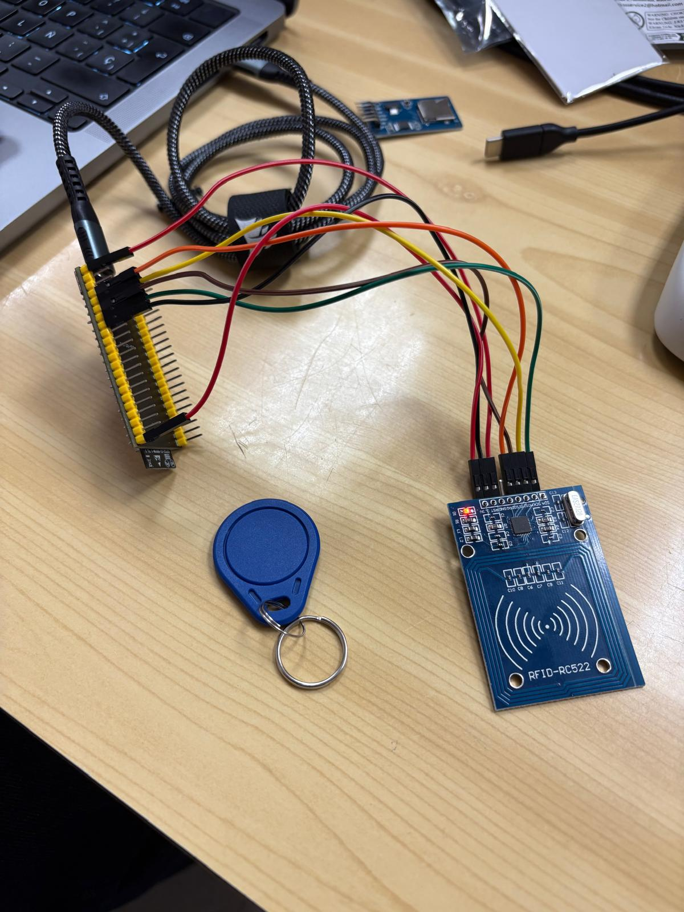

# Práctica 6: Buses de Comunicación II - SPI

## Introducción

El objetivo de esta práctica es comprender el funcionamiento del **bus SPI (Serial Peripheral Interface)**, un protocolo de comunicación serie síncrono y full-duplex ampliamente utilizado para conectar microcontroladores con periféricos de alta velocidad como memorias SD, sensores, y lectores RFID.

Se realizan dos ejercicios prácticos obligatorios:
1. Lectura desde una tarjeta SD mediante el bus SPI.
2. Lectura del UID de una tarjeta RFID usando el módulo RC522.

---

## Ejercicio 1: Lectura de tarjeta SD

### Objetivo

Leer el contenido de un archivo de texto almacenado en una tarjeta SD utilizando comunicación SPI.

### Código utilizado (`6.1.cpp`)

```cpp
#include <SPI.h>
#include <SD.h>

#define SS_PIN 10   
#define RST_PIN 9   
#define SCK_PIN 12 
#define MISO_PIN 13 
#define MOSI_PIN 11 

File myFile;

void setup() {
  Serial.begin(115200);
  Serial.print("Iniciando SD ...");

  if (!SD.begin(SS_PIN)) {
    Serial.println("No se pudo inicializar");
    return;
  }

  Serial.println("Inicialización exitosa");

  myFile = SD.open("archivo.txt");
  if (myFile) {
    Serial.println("archivo.txt:");
    while (myFile.available()) {
      Serial.write(myFile.read());
    }
    myFile.close();
  } else {
    Serial.println("Error al abrir el archivo");
  }
}

void loop() {
  // Sin tareas en el bucle principal
}
```

### Salida esperada en monitor serie

```
Iniciando SD ...
Inicialización exitosa
archivo.txt:
(Contenido del archivo)
```

### Explicación

- Se inicializa la tarjeta SD con `SD.begin()` usando el pin `SS = 10`.
- Si la tarjeta se detecta correctamente, se intenta abrir `archivo.txt`.
- El contenido del archivo se imprime byte a byte por el puerto serie.
- Se utilizan los pines definidos explícitamente para el bus SPI.

---

## Ejercicio 2: Lectura de etiqueta RFID con módulo RC522

### Objetivo

Leer el UID (Identificador Único) de una tarjeta RFID usando el lector RC522 conectado por SPI.

## Montaje



### Código utilizado (`6.2.cpp`)

```cpp
#include <Arduino.h>
#include <SPI.h>
#include <MFRC522.h>

#define SS_PIN 10
#define RST_PIN 9
#define SCK_PIN 12
#define MISO_PIN 13
#define MOSI_PIN 11

MFRC522 mfrc522(SS_PIN, RST_PIN);

void setup() {
    Serial.begin(115200);
    SPI.begin(SCK_PIN, MISO_PIN, MOSI_PIN, SS_PIN);
    mfrc522.PCD_Init();

    Serial.println("Esperando tarjeta RFID...");
}

void loop() {
    if (!mfrc522.PICC_IsNewCardPresent()) return;
    if (!mfrc522.PICC_ReadCardSerial()) return;

    Serial.print("Card UID: ");
    for (byte i = 0; i < mfrc522.uid.size; i++) {
        Serial.print(mfrc522.uid.uidByte[i] < 0x10 ? " 0" : " ");
        Serial.print(mfrc522.uid.uidByte[i], HEX);
    }
    Serial.println();

    mfrc522.PICC_HaltA();
}
```

### Salida esperada en monitor serie

```
Esperando tarjeta RFID...
Card UID: XX XX XX XX
```

### Explicación

- Se configura el bus SPI usando los pines personalizados.
- El lector RC522 se inicializa con `PCD_Init()`.
- Se espera la presencia de una nueva tarjeta RFID.
- Cuando se detecta, se imprime su UID (identificador único) en formato hexadecimal.

---

## Conclusión

Con esta práctica se logra:

- Entender la arquitectura maestro-esclavo del bus SPI.
- Utilizar SPI para leer desde una tarjeta SD.
- Integrar periféricos SPI como el lector RFID RC522.
- Manipular archivos desde microcontroladores.
- Realizar lecturas y verificaciones básicas de tarjetas RFID.
