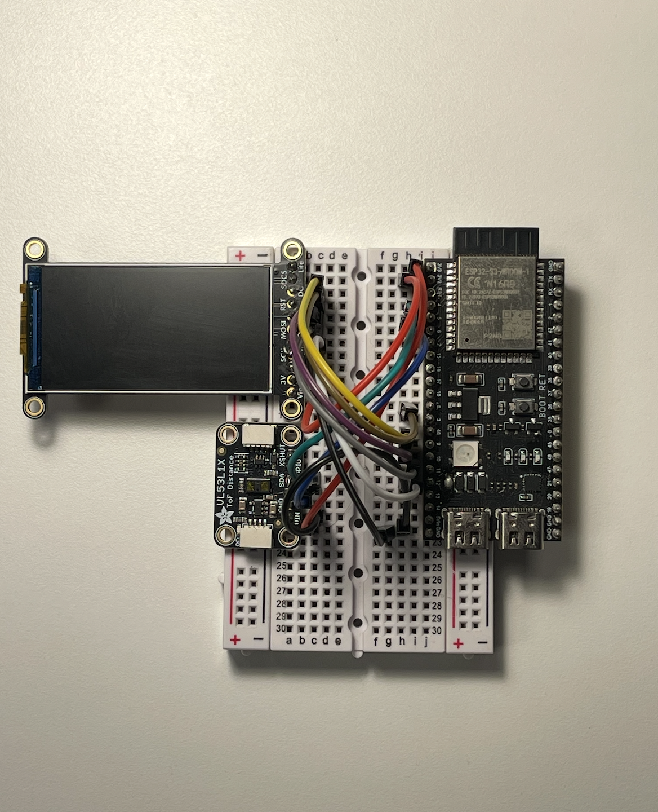
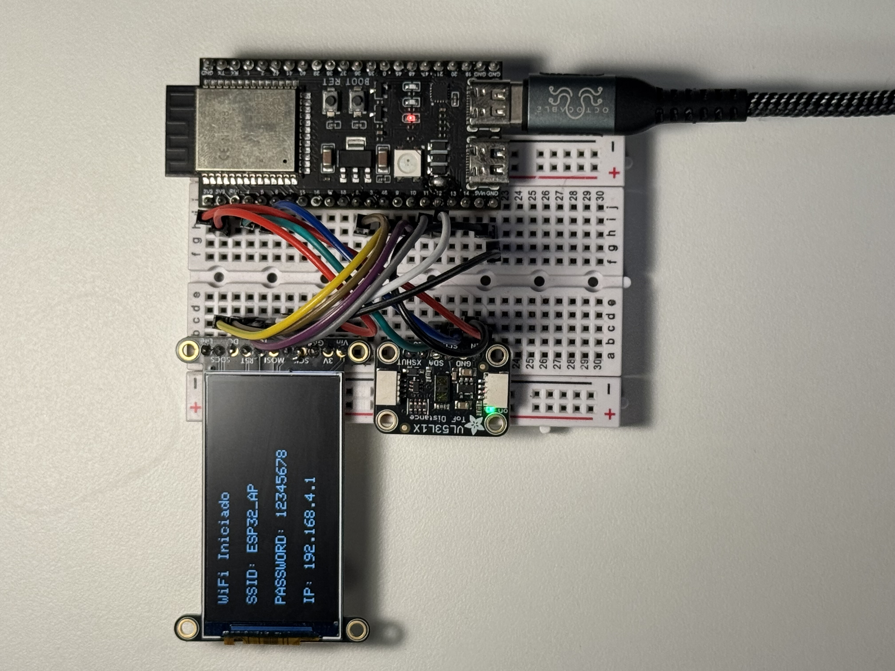
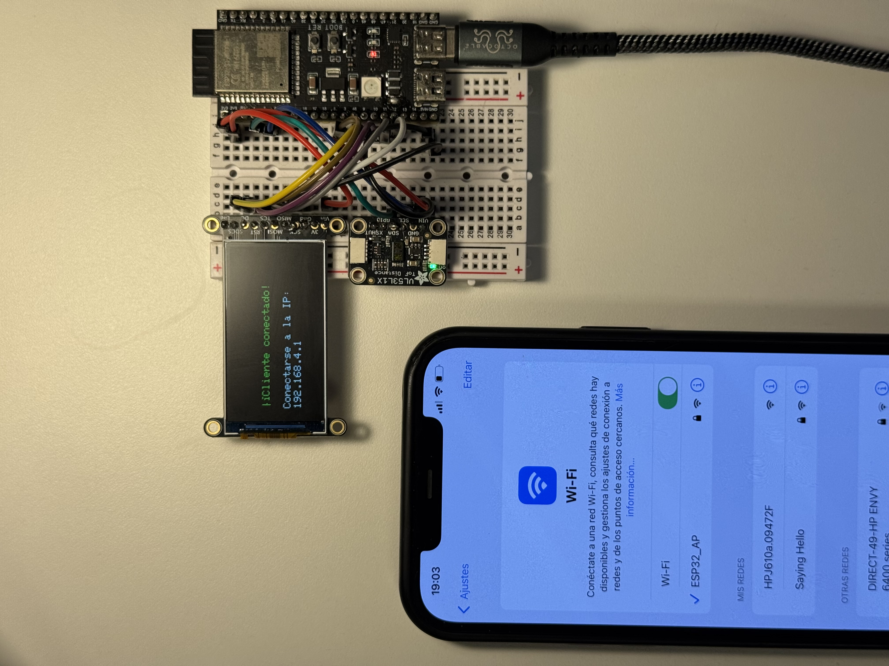
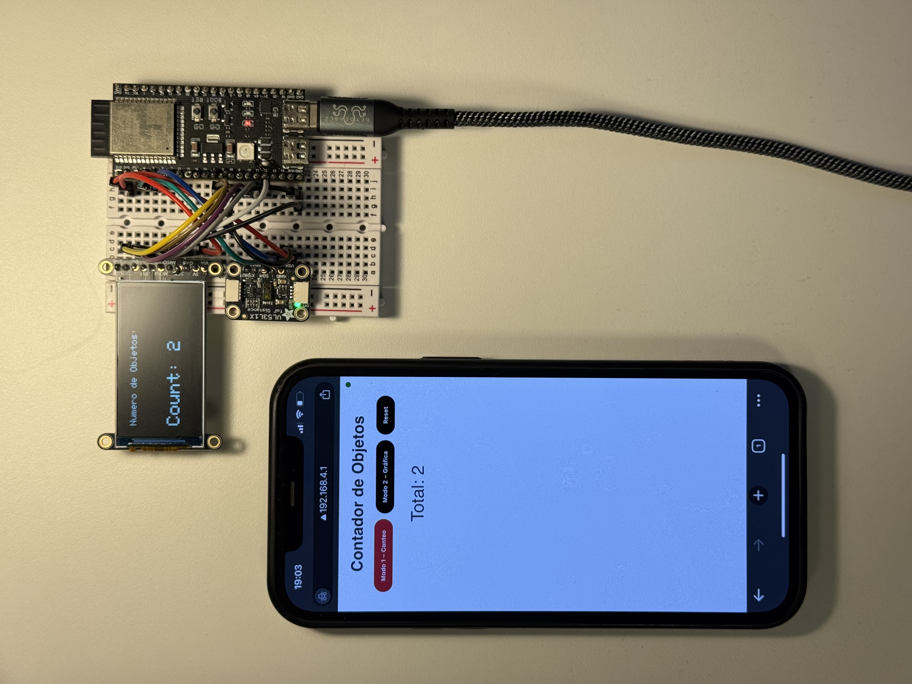
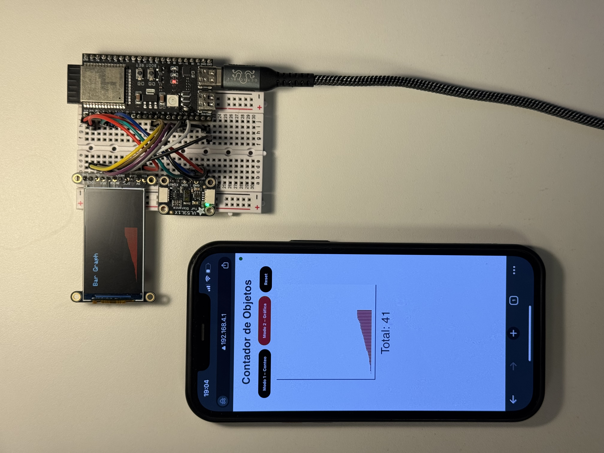

## Proyecto Contador de Objetos en Cadena de Procesado

### Introducción

Este proyecto implementa un sistema de conteo de objetos similar al que se podria usar en una cinta transportadora, empleando un sensor de distancia VL53L1X y un microcontrolador ESP32-S3. El sistema Permite:

- Detectar y contar objetos que pasan por un punto fijo.
- Mostrar el conteo en tiempo real en un display TFT ST7789.
- Generar gráficas de conteo en el display.
- Ofrecer un punto de acceso WiFi para configurar credenciales y monitorear el conteo de forma remota mediante una interfaz web.

### Descripción de funcionalidades

1. **Conteo en tiempo real**: el sensor VL53L1X detecta objetos y actualiza un contador que se muestra en el display.  
2. **Gráfica de 60 segundos**: se recopilan datos durante 60 segundos y se presentan como barras en la pantalla del display.  
3. **Configuración WiFi**: el ESP32-S3 crea un AP propio para que el usuario ingrese las credenciales de la red.  
4. **Monitoreo remoto**: los datos de conteo se envían a un servidor web integrado, mostrando el contador y una gráfica en tiempo real en el navegador.  

### Componentes y montaje

El sistema se ha montado con los siguientes elementos (precio aproximado 38,66 €): :contentReference[oaicite:1]{index=1}

- **ESP32-S3-Devkit** (5,25 €)  
- **Display TFT ST7789 (1.9" IPS 320×170)** (17,50 €)  
- **Sensor de distancia VL53L1X** (14,95 €)  



**Conexiones físicas principales:**

| Dispositivo     | Pin microcontrolador | Alimentación | Comunicación |
|-----------------|----------------------|--------------|--------------|
| ST7789 CLK      | GPIO 12              | 3.3 V, GND   | SPI          |
| ST7789 MOSI     | GPIO 11              |              |              |
| ST7789 DC       | GPIO 9               |              |              |
| ST7789 CS       | GPIO 10              |              |              |
| ST7789 RST      | GPIO 8               |              |              |
| VL53L1X SDA     | GPIO 5               | 3.3 V, GND   | I2C          |
| VL53L1X SCL     | GPIO 6               |              |              |

### Estructura de clases

- **SensorManager**: inicializa el VL53L1X, lee distancias, detecta objetos y mantiene el contador.
- **DisplayManager**: controla el TFT ST7789, muestra menús, contador, gráficas y estados WiFi.
- **WebServerManager**: gestiona el servidor web y WebSocket, envía datos al frontend y actualiza la interfaz remota.
- **SensorTest / DisplayTest**: módulos de prueba interactivos vía Serial para validar sensor y display.
- **WebServerTest**: módulo de prueba para el servidor web, que inicia y hace loop del WebServerManager para validar endpoints.

### Bibliotecas usadas

El proyecto está configurado en PlatformIO con las siguientes dependencias: :contentReference[oaicite:9]{index=9}

```ini
lib_deps =
   pololu/vl53l1x@^1.3.0
   adafruit/Adafruit GFX Library@^1.12.1
   adafruit/Adafruit ST7735 and ST7789 Library@^1.11.0
   Links2004/WebSockets@^2.3.0
```
### Flujo de ejecución detallado

1. **Arranque y menú principal**  
   Al encender, se inicializa Serial a 115200 baud y se muestra en pantalla:
   ```cpp
   === MENÚ PRINCIPAL ===
   1 - Ejecutar Programa Principal
   2 - Iniciar Tests
   ```
El usuario elige entre arrancar el programa o iniciar los tests.

2. **Creación de AP y credenciales WiFi**  
- `WebServerManager.begin()` configura el ESP32-S3 como AP con SSID y contraseña prefijados.  
- `DisplayManager.showWiFiCredentials()` dibuja en el TFT:
  > WiFi Iniciado
  > SSID:ESP32_AP
  > PASSWORD: 12345678
  > IP: 192.168.4.1




3. **Detección de conexión del cliente**  
- Al conectar un cliente (PC o móvil) al AP, el handler WebSocket (`onEvent`) detecta `WS_EVT_CONNECT`.  
- `DisplayManager.showClientConnected(clientIP)` actualiza el TFT indicando:
  > Cliente conectado! IP: 192.168.4.2
  


4. **Modo 1: Conteo en tiempo real**  
- El usuario abre el navegador en `http://192.168.4.1` y el frontend carga el websocket hacia `ws://192.168.4.1:81`.  
- Cada vez que `SensorManager.detectObject()` incrementa el contador, llama:
  ```cpp
  DisplayManager.screenCounter(totalCount);
  webSocket.broadcastTXT(String(totalCount));
  ```
- En el display se refresca el texto:
  > Objetos: X  
- En el navegador, el script WebSocket `onmessage` pinta el nuevo valor y actualiza el elemento `<span id="count">X</span>`.



5. **Modo 2: Generación de gráfica de 60 s**  
- Al seleccionar “Gráfica 60 s”, `DisplayManager.startRealTimeGraph()` borra el buffer `counts[60]`.  
- Durante 60 s, un ticker llamará cada segundo a:
  ```cpp
  counts[sec] = SensorManager.currentCount();
  DisplayManager.updateRealTimeGraph(counts, sec);
  webSocket.broadcastTXT(String(counts[sec]));
  ```
- El TFT dibuja barras de altura proporcional y muestra el número de segundo transcurrido.
- El frontend web recibe cada barra vía WebSocket y repinta un chart.js en tiempo real.  
- Tras 60 s, `DisplayManager.drawFinalGraph()` muestra la gráfica completa y, tras 5 s, retorna al menú.




